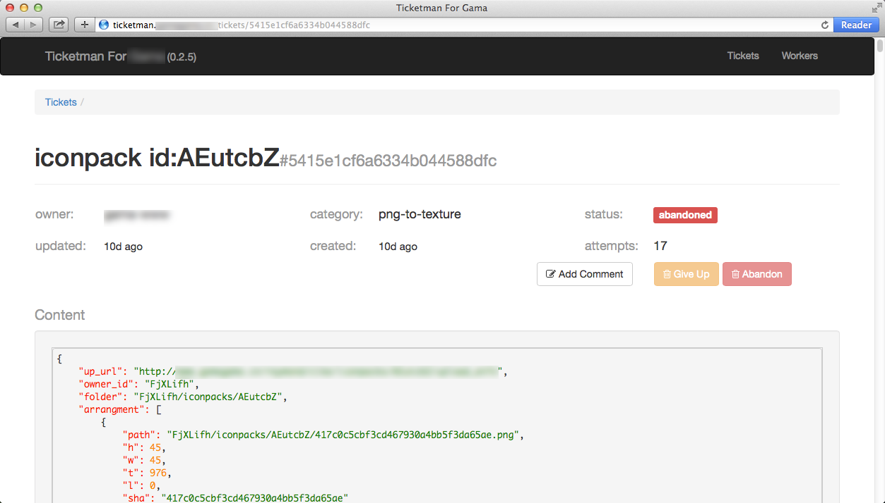
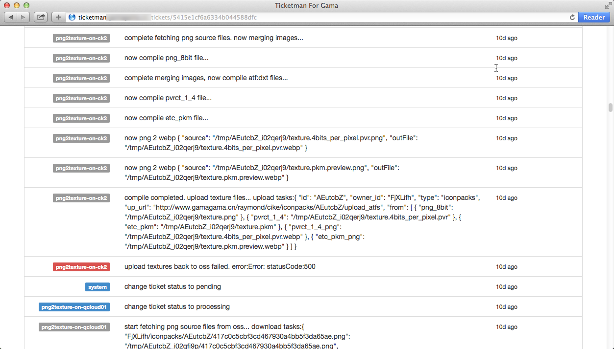
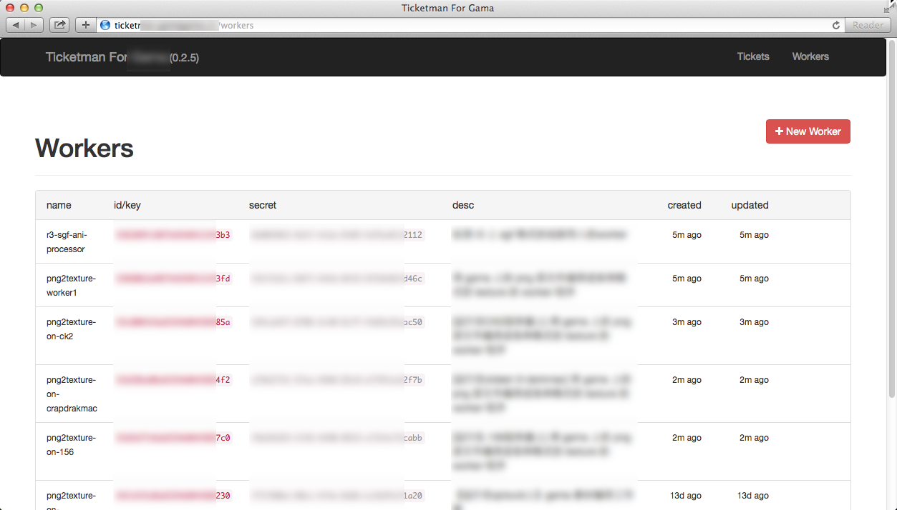

# Node Ticket Manager
A simple pull-based job/ticket system contains a central ticket
dispatcher and distributed workers. This system is written in NodeJS,
running on MongoDB.


## Differences in Poikilos' fork
- Switch from npm to yarn.
- Fix spelling errors.
- Clarify naming.


## Reason for fork
"ticketman" on npmjs.org a.k.a. "ticket-system" a.k.a.
node-ticket-manager on GitHub is no longer maintained by the original
author, Yi on GitHub (The last publish to npm is 2016, and the last
commit is 2018). There are trivial but unresolved issues in the issue
tracker. Tatsuoline on GitHub made a fork that fixes the New Ticket
option and some grammatical errors, so I forked from that.

This system consists of following 3 parts:
- Ticketman website - a ExpressJS app display the current status of the
  central ticket system
- TicketManager - a JS Class for `create(TicketManager.issue)` new ticket
- TicketWorker - a JS Class pulls ticket from Ticketman website on a
  routine, it can also complete/giveup/add comment to a ticket. The
  TicketWorker instance works on one ticket at time.


## Screenshots

### Job (Tickets) List


### Ticket detail




### Client-worker add comments to ticket



### Manage multiple client-workers




## Usage
1. Run `yarn install` to install dependencies.
2. Configure the server by creating ./config/config.js. An example
   configuration is available at ./config/config.js, but for security,
   don't use it directly--instead, make a similar file with good-quality
   passwords.

### Development
2. The default environment is "dev". In that mode, only the "dev" user
   and the node-ticket-manager_dev database are available. However, a
   web interface is available that doesn't require the client.
   - run `yarn start` to start the service
3. Open <http://localhost:3456> in your web browser

#### Production
To enable the production database named "node-ticket-manager" and the
production user defined in your config.js, run using:
```
export NODE_ENV=production
yarn start
```

Then you will need to proceed to the readme file at
<https://github.com/poikilos/node-ticket-manager-client>.


## NodeJS Module Usage
```javascript
var  TicketWorker = require("node-ticket-manager").TicketWorker;
var  TicketManager = require("node-ticket-manager").TicketManager;
```

## TicketManager API

```
new TicketManager : (@name, @host, basicAuth) ->

TicketManager.issue()
// issue : (title, category, content, callback)->
```

## TicketWorker API

### Instance construction
```
  constructor: (options={}) ->
  # @param {Object} options, optionally includes:
  #     options.name
  #     options.id
  #     options.consumerSecret
  #     options.host
  #     options.category
  #     options.timeout : ticket processing timeout in ms
  #     options.interval : self checking interval
  #     options.basicAuth : basicAuth
  #
```

### Events:

 * on "new ticket", listener signature: eventListener(ticket)
 * on "complete", listener signature: eventListener(ticket)
 * on "giveup", listener signature: eventListener(ticket)

### Instance Methods

 * complete : ()->
 * update : (message, kind='default')->
 * giveup: (reason)->

## HTTP API Calls:

### POST '/api/tickets/new', Admin create ticket

req.body:
```
{
  title : "title of ticket",
  owner_id : "name of owner",
  category : "category the ticket belongs to",
  content : {
    detailed : "content of ticket",
    mixed : ["data"]
  }
}
```

### PUT '/api/tickets/assign', Worker ask for a ticket assignment

req.body:
```
{
  worker : "assignment worker"
  category : "category the ticket belongs to"
}
```

### PUT '/api/tickets/:id/comment', Worker add comment to a ticket

req.body:
```
{
  name : "worker",
  kind : "info",
  content : "test comment"
}
```

### PUT '/api/tickets/:id/complete', Worker complete a ticket

req.body:
```
{
  name : "worker"
}
```

### PUT '/api/tickets/:id/giveup', Worker giveup a ticket
req.body:
```
{
  name : "worker"
}
```
## Authors & License
- Copyright (c) 2014 yi, 2020 Poikilos
- License: See the license file.
